# PIPELINE_GRAPH — CODE/ dependency map

> Generated by `CODE/_pipeline_graph.py` (read-only). The numbering in `CODE/NN_*.py`
> encodes dependency order; this map makes the *actual* source-level references explicit
> and tags each edge EXTRACTED (verified in source) vs INFERRED (numbering backbone).
> STATE.md remains the source of truth for live values; regenerate after adding a step.

- scripts mapped: **57**
- edges: **40 EXTRACTED**, **33 INFERRED**

## Graph

```mermaid
graph LR
  n_02_make_dataset["02_make_dataset"]
  n_03_make_metadata["03_make_metadata"]
  n_04_search["04_search"]
  n_05_tokenize["05_tokenize"]
  n_06_enrich_pop60s["06_enrich_pop60s"]
  n_10_scan["10_scan"]
  n_11_features["11_features"]
  n_12_signatures["12_signatures"]
  n_13_chords["13_chords"]
  n_14_provenance["14_provenance"]
  n_15_catalog["15_catalog"]
  n_16_splits_pools["16_splits_pools"]
  n_17_stats["17_stats"]
  n_18_fill_song_id_and_split["18_fill_song_id_and_split"]
  n_19_quality_flags["19_quality_flags"]
  n_20_audio_sanity["20_audio_sanity"]
  n_21_sequences["21_sequences"]
  n_22_rhythm_refine["22_rhythm_refine"]
  n_23_catalog_merge["23_catalog_merge"]
  n_24_melody_refine["24_melody_refine"]
  n_25_harmony_refine["25_harmony_refine"]
  n_26_signature_extend["26_signature_extend"]
  n_27_emptyspace["27_emptyspace"]
  n_28_build_pool["28_build_pool"]
  n_28_mapserver["28_mapserver"]
  n_29_groove_dna["29_groove_dna"]
  n_30_mcp_groove["30_mcp_groove"]
  n_31_drum_vector["31_drum_vector"]
  n_32_drum_emptyspace["32_drum_emptyspace"]
  n_33_drum_catalog["33_drum_catalog"]
  n_34_drum_corner_audio["34_drum_corner_audio"]
  n_35_drum_vector_v2["35_drum_vector_v2"]
  n_36_pool_preview["36_pool_preview"]
  n_37_taste_stub["37_taste_stub"]
  n_38_pool_sampler_v2["38_pool_sampler_v2"]
  n_39_drum_umap["39_drum_umap"]
  n_40_sql_explore["40_sql_explore"]
  n_41_redetect_tempo_meter["41_redetect_tempo_meter"]
  n_42_detect_eval["42_detect_eval"]
  n_43_redetect_key["43_redetect_key"]
  n_44_merge_detection["44_merge_detection"]
  n_45_rhythm_knn_probe["45_rhythm_knn_probe"]
  n_46_taste_rerank["46_taste_rerank"]
  n_47_propagator["47_propagator"]
  n_48_active_pool["48_active_pool"]
  n_49_sig_one["49_sig_one"]
  n_50_generate["50_generate"]
  n_50_theory_gate["50_theory_gate"]
  n_51_remix["51_remix"]
  n_51_tbb_feature["51_tbb_feature"]
  n_52_invention_loop["52_invention_loop"]
  n_53_validate_corpus["53_validate_corpus"]
  n_60_counterpoint["60_counterpoint"]
  n_61_harmony_deep["61_harmony_deep"]
  n_62_melody_deep["62_melody_deep"]
  n_63_signature_v3["63_signature_v3"]
  n_genre_engine["genre_engine"]
  n_02_make_dataset -.-> n_03_make_metadata
  n_03_make_metadata -.-> n_04_search
  n_03_make_metadata --> n_49_sig_one
  n_04_search -.-> n_05_tokenize
  n_04_search --> n_06_enrich_pop60s
  n_10_scan --> n_11_features
  n_10_scan --> n_41_redetect_tempo_meter
  n_11_features --> n_10_scan
  n_11_features -.-> n_12_signatures
  n_12_signatures -.-> n_13_chords
  n_12_signatures --> n_18_fill_song_id_and_split
  n_12_signatures --> n_49_sig_one
  n_13_chords -.-> n_14_provenance
  n_14_provenance -.-> n_15_catalog
  n_15_catalog --> n_11_features
  n_15_catalog -.-> n_16_splits_pools
  n_16_splits_pools -.-> n_17_stats
  n_18_fill_song_id_and_split -.-> n_19_quality_flags
  n_19_quality_flags -.-> n_20_audio_sanity
  n_19_quality_flags --> n_23_catalog_merge
  n_20_audio_sanity -.-> n_21_sequences
  n_21_sequences --> n_22_rhythm_refine
  n_21_sequences --> n_49_sig_one
  n_22_rhythm_refine --> n_24_melody_refine
  n_22_rhythm_refine --> n_29_groove_dna
  n_22_rhythm_refine --> n_49_sig_one
  n_23_catalog_merge --> n_29_groove_dna
  n_24_melody_refine -.-> n_25_harmony_refine
  n_24_melody_refine --> n_49_sig_one
  n_25_harmony_refine --> n_49_sig_one
  n_26_signature_extend -.-> n_27_emptyspace
  n_26_signature_extend --> n_49_sig_one
  n_27_emptyspace -.-> n_28_build_pool
  n_29_groove_dna --> n_23_catalog_merge
  n_29_groove_dna --> n_26_signature_extend
  n_29_groove_dna --> n_30_mcp_groove
  n_29_groove_dna --> n_31_drum_vector
  n_29_groove_dna --> n_49_sig_one
  n_31_drum_vector -.-> n_32_drum_emptyspace
  n_31_drum_vector --> n_33_drum_catalog
  n_31_drum_vector --> n_35_drum_vector_v2
  n_31_drum_vector --> n_51_tbb_feature
  n_33_drum_catalog -.-> n_34_drum_corner_audio
  n_35_drum_vector_v2 -.-> n_36_pool_preview
  n_36_pool_preview -.-> n_37_taste_stub
  n_37_taste_stub -.-> n_38_pool_sampler_v2
  n_37_taste_stub --> n_46_taste_rerank
  n_38_pool_sampler_v2 -.-> n_39_drum_umap
  n_39_drum_umap --> n_28_mapserver
  n_39_drum_umap -.-> n_40_sql_explore
  n_41_redetect_tempo_meter -.-> n_42_detect_eval
  n_42_detect_eval -.-> n_43_redetect_key
  n_43_redetect_key -.-> n_44_merge_detection
  n_44_merge_detection -.-> n_45_rhythm_knn_probe
  n_46_taste_rerank -.-> n_47_propagator
  n_47_propagator -.-> n_48_active_pool
  n_47_propagator --> n_52_invention_loop
  n_49_sig_one --> n_50_generate
  n_49_sig_one --> n_50_theory_gate
  n_49_sig_one --> n_52_invention_loop
  n_50_generate --> n_50_theory_gate
  n_50_generate --> n_51_remix
  n_50_generate --> n_genre_engine
  n_50_theory_gate --> n_50_generate
  n_50_theory_gate --> n_51_remix
  n_50_theory_gate --> n_52_invention_loop
  n_51_remix --> n_genre_engine
  n_52_invention_loop -.-> n_53_validate_corpus
  n_53_validate_corpus -.-> n_60_counterpoint
  n_60_counterpoint -.-> n_61_harmony_deep
  n_61_harmony_deep -.-> n_62_melody_deep
  n_62_melody_deep -.-> n_63_signature_v3
  n_genre_engine --> n_50_generate
```

Solid `-->` = EXTRACTED (source-verified). Dotted `-.->` = INFERRED (numbering backbone).

## Table

| script | purpose | upstream (EXTRACTED) | upstream (INFERRED) |
|---|---|---|---|
| `02_make_dataset` | build the deduplicated canonical MIDI store. | — | — |
| `03_make_metadata` | LAMD-style metadata over the deduped MIDIs store. | — | `02_make_dataset` |
| `04_search` | similarity search over the merged corpus. | — | `03_make_metadata` |
| `05_tokenize` | SkyTNT-aligned tokenized training corpus. | — | `04_search` |
| `06_enrich_pop60s` | first-pass genre/era enrichment for MIDIS_ALL_REAL. | `04_search` | — |
| `10_scan` | Phase 1 + parse-only features. The ONE TMIDIX parse pass. | `11_features` | — |
| `11_features` | Phase 2 features derived from the META_DATA pickles (NO parse). | `10_scan`, `15_catalog` | — |
| `12_signatures` | Phase 3 similarity signatures + index + near-dup clusters. | — | `11_features` |
| `13_chords` | Phase 4 chord/harmony summary from pickles (NO parse). | — | `12_signatures` |
| `14_provenance` | Phase 5 targeted tagging (composer/title/genre/era). | — | `13_chords` |
| `15_catalog` | Phase 6 merge everything into the catalog. | — | `14_provenance` |
| `16_splits_pools` | Phase 7 song-level splits + curated pools. | — | `15_catalog` |
| `17_stats` | Phase 8 corpus statistics + dataset card (text, no heavy deps). | — | `16_splits_pools` |
| `18_fill_song_id_and_split` | KNOWN GAPS fix #1 + #2 (see STATE.md). | `12_signatures` | — |
| `19_quality_flags` | KNOWN GAPS fix #3 + #4 + #5 (see STATE.md). No reparse; all derivable from | — | `18_fill_song_id_and_split` |
| `20_audio_sanity` | Phase 9.1 — Audio sanity render. | — | `19_quality_flags` |
| `21_sequences` | Phase 9.2/9.3/9.4 + 9.R RHYTHM. The second (and final) TMIDIX pass. | — | `20_audio_sanity` |
| `22_rhythm_refine` | authoritative RHYTHM detection, recomputed from the cache. | `21_sequences` | — |
| `23_catalog_merge` | fold the Phase-9 sequence features into the catalog. | `19_quality_flags`, `29_groove_dna` | — |
| `24_melody_refine` | deep MELODY features, recomputed from the NOTESEQ_DATA cache. | `22_rhythm_refine` | — |
| `25_harmony_refine` | deep HARMONY features, recomputed from the NOTESEQ_DATA cache. | — | `24_melody_refine` |
| `26_signature_extend` | extend the 36-D pitch signature with rhythm / | `29_groove_dna` | — |
| `27_emptyspace` | Phase 11 #1: the EMPTY-SPACE HUNT over the N×88 signature. | — | `26_signature_extend` |
| `28_build_pool` | Grok hybrid "elite" sampling for the NinjaStar-8 rating pool. | — | `27_emptyspace` |
| `28_mapserver` | clickable, audible map of a chosen MUSIC-EMBEDDING space. | `39_drum_umap` | — |
| `29_groove_dna` | the canonical 11-D RHYTHM VECTOR ("GrooveDNA") for the corpus. | `22_rhythm_refine`, `23_catalog_merge` | — |
| `30_mcp_groove` | MCP (Mini-Compact-Pattern) drum notation: parse + generate. | `29_groove_dna` | — |
| `31_drum_vector` | "DrumDNA": a dedicated, research-grounded DRUM SIGNATURE. | `29_groove_dna` | — |
| `32_drum_emptyspace` | Empty-space hunt in the 72-D DrumDNA space. | — | `31_drum_vector` |
| `33_drum_catalog` | fold DrumDNA scalars into the catalog. | `31_drum_vector` | — |
| `34_drum_corner_audio` | Render top drum-corner songs to WAV. | — | `33_drum_catalog` |
| `35_drum_vector_v2` | "DrumDNA v2": the research-standard drum signature. | `31_drum_vector` | — |
| `36_pool_preview` | DRY-RUN preview of the 500 "clean stratified, rhythm-heavy" pool. | — | `35_drum_vector_v2` |
| `37_taste_stub` | taste-propagator STUB (Grok instruction 2, item 3). | — | `36_pool_preview` |
| `38_pool_sampler_v2` | Grok-locked rhythm pool sampler (GROK-LOCKED-RHYTHM). | — | `37_taste_stub` |
| `39_drum_umap` | build a DRUM-FEEL 2-D UMAP from the 72-D drum-only signature. | — | `38_pool_sampler_v2` |
| `40_sql_explore` | SQL-driven taste-targeted candidate finder (Windows / LocalDB) | — | `39_drum_umap` |
| `41_redetect_tempo_meter` | correct BPM + time-signature READ from the MIDI itself. | `10_scan` | — |
| `42_detect_eval` | score detectors against human ear-labels. | — | `41_redetect_tempo_meter` |
| `43_redetect_key` | fix key detection + its confidence, recomputed from NOTESEQ cache. | — | `42_detect_eval` |
| `44_merge_detection` | fold the validated v2 detection columns into the catalog. | — | `43_redetect_key` |
| `45_rhythm_knn_probe` | regression probe for the rhythm/kNN block. | — | `44_merge_detection` |
| `46_taste_rerank` | TASK 1: re-rank empty corners by predicted taste on N×88. | `37_taste_stub` | — |
| `47_propagator` | the canonical TASTE PROPAGATOR on the N×88 signature. | — | `46_taste_rerank` |
| `48_active_pool` | ACTIVE-LEARNING pool for NinjaStar-8. | — | `47_propagator` |
| `49_sig_one` | signature-of-ONE-MIDI: embed a single .mid into the SAME N×88 | `03_make_metadata`, `12_signatures`, `21_sequences`, `22_rhythm_refine`, `24_melody_refine`, `25_harmony_refine`, `26_signature_extend`, `29_groove_dna` | — |
| `50_generate` | route-C generator: land NEW music in an empty corner of the | `49_sig_one`, `50_theory_gate`, `genre_engine` | — |
| `50_theory_gate` | theory-gated, 8-bit-aware enhancement of a candidate MIDI. | `49_sig_one`, `50_generate` | — |
| `51_remix` | COHERENT REMIX: keep one song's full backing (drums + bass + | `50_generate`, `50_theory_gate` | — |
| `51_tbb_feature` | TBB v1 corpus feature (SAFE / additive / versioned). | `31_drum_vector` | — |
| `52_invention_loop` | autonomous, coordinate-driven INVENTION loop. | `47_propagator`, `49_sig_one`, `50_theory_gate` | — |
| `53_validate_corpus` | READ-ONLY Medallion-model quality gate for the corpus. | — | `52_invention_loop` |
| `60_counterpoint` | COUNTERPOINT (horizontal) feature pass, primary 4-pillar target. | — | `53_validate_corpus` |
| `61_harmony_deep` | deepen vertical HARMONY (pillar 2). | — | `60_counterpoint` |
| `62_melody_deep` | deepen MELODY pillar (contour, motif, expectancy). | — | `61_harmony_deep` |
| `63_signature_v3` | build balanced 4-pillar v3 signature + kNN (versioned, safe). | — | `62_melody_deep` |
| `genre_engine` | turn coherent musical material into a GENRE-IDIOMATIC song. | `50_generate`, `51_remix` | — |
